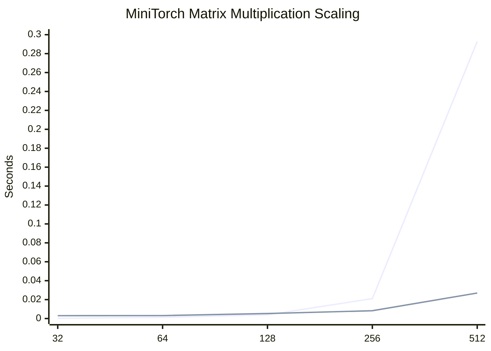

# MiniTorch

MiniTorch is a PyTorch-style deep learning framework built from scratch in Python. It reimplements the core layers of modern ML systems: scalar autodiff, tensor storage, broadcasting, optimized CPU tensor kernels, CUDA kernels, neural-network modules, and end-to-end training loops.

The goal is not to outperform PyTorch. The goal is to understand what PyTorch is doing underneath: how computation graphs are built, how gradients flow backward, how tensor shape/stride metadata works, and how backend kernels make tensor programs fast.

## Highlights

- Built reverse-mode automatic differentiation from first principles.
- Implemented scalar and tensor abstractions with operator overloading.
- Added broadcasting-aware tensor operations, reshaping, permutation, reductions, and batched matrix multiplication.
- Implemented Numba-optimized CPU kernels for map, zip, reduce, and matrix multiply.
- Implemented CUDA tensor kernels, including shared-memory matrix multiplication.
- Built neural-network primitives such as ReLU, sigmoid, softmax, log-softmax, pooling, and dropout.
- Trained small MLPs on nonlinear classification datasets using the MiniTorch engine.

## Performance Snapshot

| Signal | Result | Why It Matters |
| --- | --- | --- |
| Matrix multiply scaling | MiniTorch CUDA is 10.86x faster than MiniTorch fast CPU at 512x512 | Shows GPU kernels win once the workload is large enough |
| 10k-point MLP training | MiniTorch CUDA: 24.3043s vs MiniTorch fast CPU: 25.4046s | Shows larger batches/preloaded tensors can make CUDA viable |
| PyTorch baseline | PyTorch CPU remains far faster: 0.0829s on the same 10k MLP workload | Keeps the comparison honest against production-grade kernels |



Detailed methodology, raw timings, timing breakdowns, and CUDA limitations are
kept in the [Benchmarks](#benchmarks) section.

## Why This Project Matters

Most ML projects show that you can use a framework. MiniTorch shows that you understand how a framework works.

This project is most relevant for:

- Machine learning engineering
- ML systems and infrastructure
- Deep learning systems
- Performance-oriented software engineering

It demonstrates practical understanding of autodiff, tensor layouts, backend abstraction, kernel optimization, correctness testing, and training behavior.

## Architecture

MiniTorch is organized as a staged framework build:

| Stage | Focus | Main Ideas |
| --- | --- | --- |
| Module 0 | Foundations | Mathematical operators and higher-order functional primitives |
| Module 1 | Scalar autodiff | Computation graphs, topological sorting, chain-rule backpropagation |
| Module 2 | Tensor engine | Storage, shapes, strides, broadcasting, tensor operations |
| Module 3 | Performance backends | Numba CPU kernels and CUDA kernels |
| Module 4 | Neural networks | Pooling, dropout, softmax, MLP/CNN-style training demos |

## Repository Structure

```text
minitorch/     # Core framework implementation
tests/         # Correctness tests for operators, autodiff, tensors, modules, conv, and NN ops
examples/      # Small training demos and runnable examples
benchmarks/    # Backend/parallelism comparison utilities
demo_app/      # Interactive demo-facing helpers and interfaces
archive/       # Earlier course milestones kept for reference
docs/          # Supporting documentation/assets
```

## Core Components

| File/Area | Purpose |
| --- | --- |
| `minitorch/operators.py` | Scalar mathematical primitives |
| `minitorch/autodiff.py` | Backpropagation utilities and topological sorting |
| `minitorch/scalar.py` | Scalar value object with autodiff history |
| `minitorch/tensor_data.py` | Tensor storage, indexing, shapes, and strides |
| `minitorch/tensor_ops.py` | Backend-agnostic tensor map/zip/reduce operations |
| `minitorch/fast_ops.py` | Numba-optimized CPU tensor backend |
| `minitorch/cuda_ops.py` | CUDA tensor backend |
| `minitorch/nn.py` | Neural-network operations such as pooling, dropout, and softmax |
| `minitorch/module.py` | Module and parameter abstractions |

## Installation

Create a virtual environment and install the project in editable mode:

```bash
python -m venv .venv
source .venv/bin/activate
pip install -r requirements.txt
pip install -e .
```

On Windows PowerShell:

```powershell
python -m venv .venv
.\.venv\Scripts\Activate.ps1
pip install -r requirements.txt
pip install -e .
```

Optional demo dependencies:

```bash
pip install -r requirements.extra.txt
```

## Running Tests

Run the full correctness suite:

```bash
pytest
```

Run targeted suites:

```bash
pytest tests/test_autodiff.py
pytest tests/test_tensor.py
pytest tests/test_nn.py
pytest tests/test_conv.py
```

The tests cover gradient correctness, scalar/tensor operations, broadcasting, tensor indexing, modules, neural-network utilities, and convolution behavior.

CUDA backend tests are opt-in so the default suite works on machines without a reliable CUDA context:

```bash
MINITORCH_RUN_CUDA_TESTS=true pytest tests/test_tensor_general.py
```

On Windows PowerShell:

```powershell
$env:MINITORCH_RUN_CUDA_TESTS="true"
pytest tests/test_tensor_general.py
```

## Running Examples

Train a small tensor-based MLP:

```bash
python examples/train_mlp.py
```

Run the scalar MLP demo:

```bash
python examples/scalar_mlp_demo.py
```

Run the MNIST CNN-style demo if the optional dataset dependency and MNIST files are available:

```bash
python examples/mnist_cnn_demo.py
```

## Benchmarks

MiniTorch includes both correctness-oriented and performance-oriented validation.

Benchmark claims should be tied to the standard methodology in
[`benchmarks/BENCHMARKS.md`](benchmarks/BENCHMARKS.md). The local benchmark record
for the primary development machine is
[`benchmarks/results/local_i9_12900h_rtx3070ti.md`](benchmarks/results/local_i9_12900h_rtx3070ti.md).

Current measured CPU/PyTorch results from the standard local benchmark environment:

| Workload | Backend | Config | Median Time |
| --- | --- | --- | --- |
| MLP training | MiniTorch fast CPU | simple, 250 points, hidden=10, batch_size=10, 25 epochs | 3.6311s |
| MLP training | PyTorch CPU fair mini-batch | simple, 250 points, hidden=10, batch_size=10, 25 epochs | 0.2016s |
| MLP training | MiniTorch fast CPU | split, 250 points, hidden=10, batch_size=10, 25 epochs | 3.6641s |
| MLP training | PyTorch CPU fair mini-batch | split, 250 points, hidden=10, batch_size=10, 25 epochs | 0.2040s |
| MLP training | MiniTorch fast CPU | xor, 250 points, hidden=10, batch_size=10, 25 epochs | 3.6415s |
| MLP training | PyTorch CPU fair mini-batch | xor, 250 points, hidden=10, batch_size=10, 25 epochs | 0.1964s |

Latest CUDA validation on the RTX 3070 Ti Laptop GPU:

| Dataset | MiniTorch fast CPU | MiniTorch CUDA | PyTorch CPU |
| --- | ---: | ---: | ---: |
| simple | 0.2882s | 6.0520s | 0.0174s |
| split | 0.2911s | 6.0108s | 0.0166s |
| xor | 0.2894s | 5.9098s | 0.0160s |

The CUDA backend is functionally validated in a dedicated `minitorch-cuda`
environment, but it is slower for this small MLP workload. That result is
expected for this implementation because training launches many small kernels
and still pays host/device transfer overhead. The benchmark is used to study
backend behavior, not to claim GPU speedup.

With a larger MLP workload (`points=1000`, `hidden=64`, `batch_size=100`),
MiniTorch CUDA narrows the gap but still does not beat MiniTorch fast CPU:

| Dataset | MiniTorch fast CPU | MiniTorch CUDA | PyTorch CPU |
| --- | ---: | ---: | ---: |
| xor | 3.2728s | 6.3295s | 0.0171s |

With benchmark-only preloaded batches and evaluation disabled during timing, a larger
10,000-point XOR workload gives the CUDA backend enough work to slightly beat
MiniTorch fast CPU:

| Dataset | Config | MiniTorch fast CPU | MiniTorch CUDA | PyTorch CPU |
| --- | --- | ---: | ---: | ---: |
| xor | points=10000, hidden=64, epochs=3, batch_size=1000, preloaded batches | 25.4046s | 24.3043s | 0.0829s |

Timing breakdown shows that loss/backward dominates this workload. MiniTorch CUDA
spends less time in loss/backward than MiniTorch fast CPU, but still pays extra
forward/optimizer overhead. A full-batch CUDA run at `batch_size=10000` currently
fails with an assertion, so the safe claim is limited to the validated 1,000-item
batches above.

Matrix multiplication scaling shows the workload-size effect more clearly:

| Matrix Size | MiniTorch fast CPU | MiniTorch CUDA | CUDA vs MiniTorch CPU |
| ---: | ---: | ---: | ---: |
| 32 | 0.000294s | 0.003012s | 0.10x |
| 64 | 0.001335s | 0.003107s | 0.43x |
| 128 | 0.003955s | 0.005294s | 0.75x |
| 256 | 0.021037s | 0.008230s | 2.56x |
| 512 | 0.292770s | 0.026949s | 10.86x |

CUDA loses on small matrices where launch overhead dominates, then overtakes
MiniTorch fast CPU once the matrix is large enough to amortize that overhead.
PyTorch CPU remains much faster overall because it relies on mature native
linear algebra kernels.

Run backend diagnostics:

```bash
python benchmarks/parallel_check.py
```

Check CUDA runtime health:

```bash
python benchmarks/cuda_health.py --markdown
```

Run the PyTorch comparison trainer:

```bash
python benchmarks/run_torch.py
```

Run the standardized benchmark suite:

```bash
python benchmarks/run_all.py --runs 5 --warmups 1 --epochs 25 --points 250 --hidden 10 --batch-size 10 --datasets simple split xor
```

Run the CUDA validation benchmark:

```bash
python benchmarks/run_all.py --include-cuda --runs 3 --warmups 1 --epochs 5 --points 100 --hidden 10 --batch-size 10 --datasets simple split xor
```

Run a larger MLP benchmark with preloaded batches and timing breakdown:

```bash
python benchmarks/run_all.py --include-cuda --runs 2 --warmups 1 --epochs 3 --points 10000 --hidden 64 --batch-size 1000 --datasets xor --preload-batches --skip-eval --collect-timing
```

Run matrix multiplication scaling:

```bash
python benchmarks/run_matmul_scaling.py --include-cuda --include-torch --runs 5 --warmups 1 --sizes 32 64 128 256 512
```

Benchmark results depend on hardware, Python version, backend availability, tensor size, and warmup behavior. The benchmark numbers above should be treated as project-scale measurements rather than universal claims.

## Interview Talking Points

Useful ways to explain this project:

- I rebuilt reverse-mode autodiff from scalar graphs to tensor graphs.
- I implemented shape/stride-aware tensor storage instead of treating tensors as plain nested lists.
- I validated gradients using derivative checks and nonlinear training tasks.
- I compared naive and optimized tensor backends and saw performance improve as tensor sizes grew.
- I connected low-level backend design to visible training behavior.

## Limitations

MiniTorch is an educational ML systems framework. It is not intended to replace PyTorch for production training. The value of the project is in the implementation depth: autodiff mechanics, tensor abstraction, backend kernels, correctness tests, and systems-level understanding.

## License

This project is released under the MIT License.
