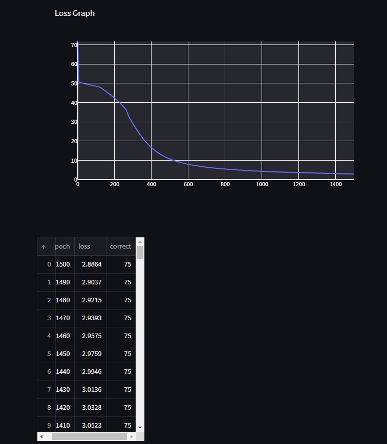

[](https://classroom.github.com/a/7COonC5j)
# MiniTorch Module 1


* Docs: https://minitorch.github.io/

* Overview: https://minitorch.github.io/module1/module1/

## Dataset Graphs and Training Logs

### Simple Dataset
* Simple Dataset Graph:
  
* Simple Train Log and Loss Plot:
  

### Diag Dataset
* Diag Dataset Graph:
  
* Diag Train Log and Loss Plot:
  

### Split Dataset
* Split Dataset Graph:
  
* Split Train Log and Loss Plot:
  

### Xor Dataset
* Xor Dataset Graph:
  
* Xor Train Log and Loss Plot:
  

This assignment requires the following files from the previous assignments. You can get these by running

```bash
python sync_previous_module.py previous-module-dir current-module-dir
```

The files that will be synced are:

        minitorch/operators.py minitorch/module.py tests/test_module.py tests/test_operators.py project/run_manual.py

