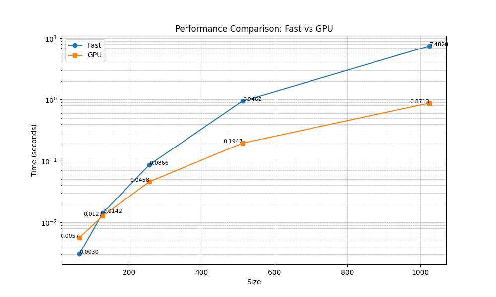
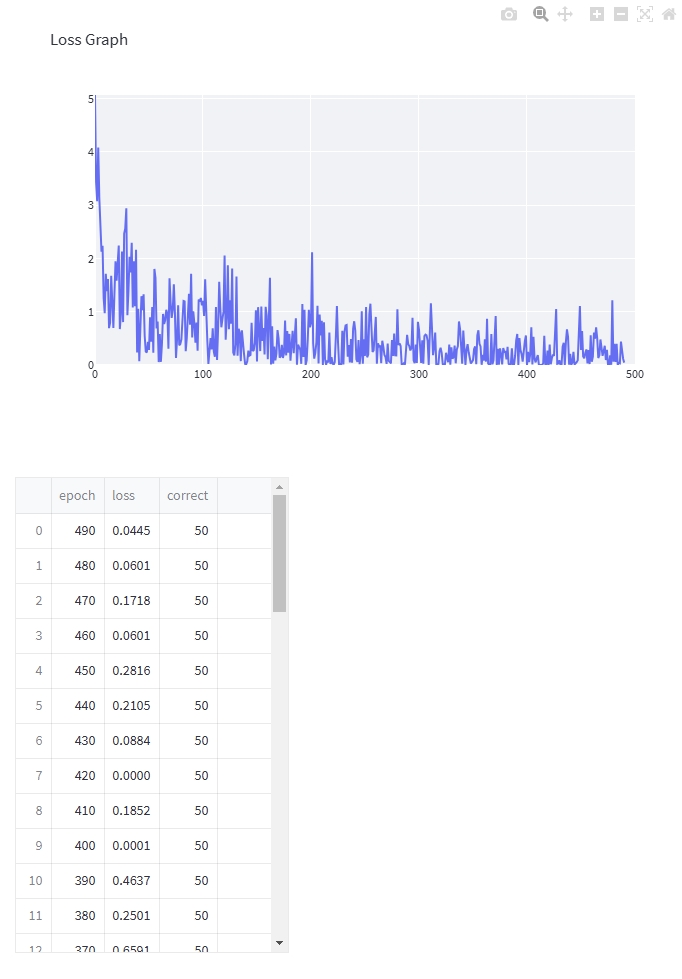
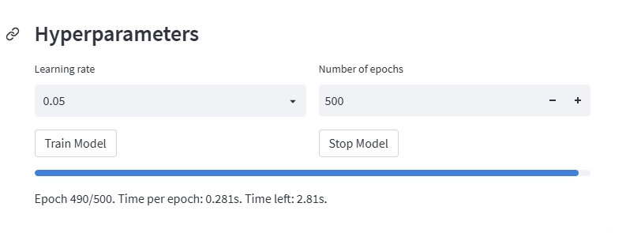
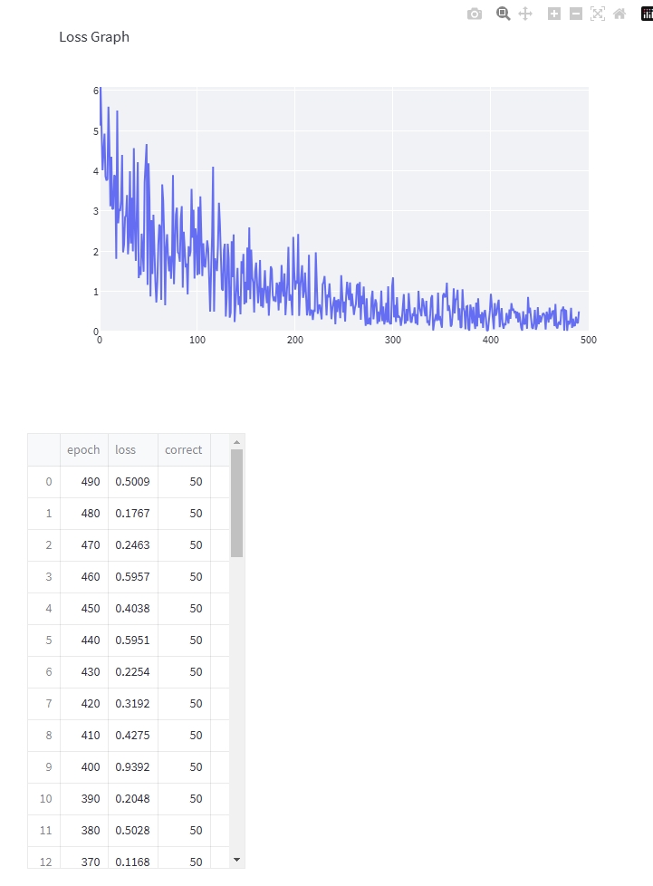
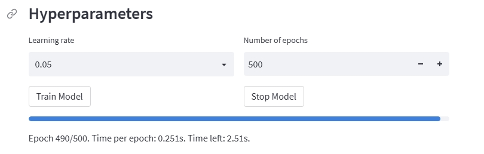
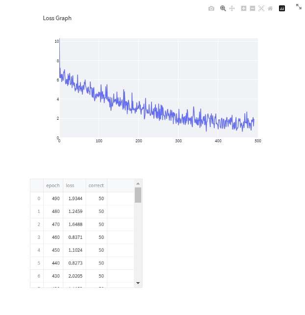
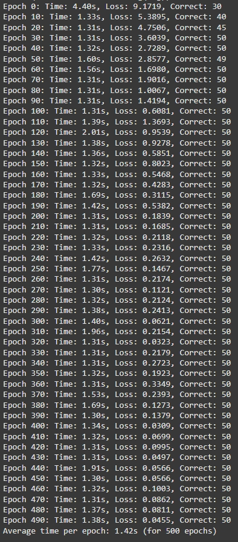
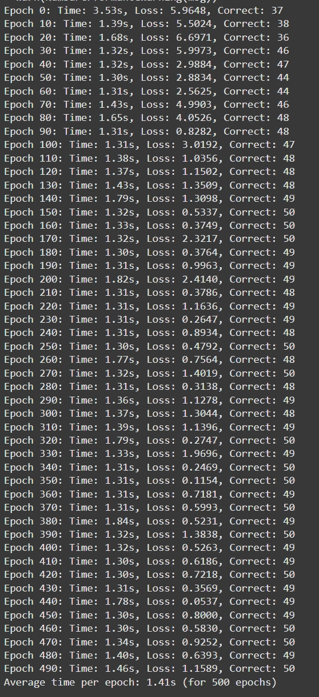
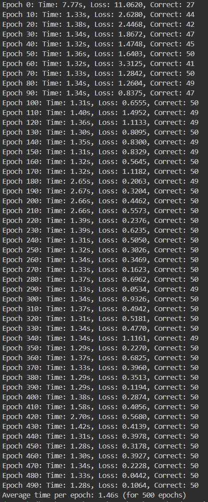
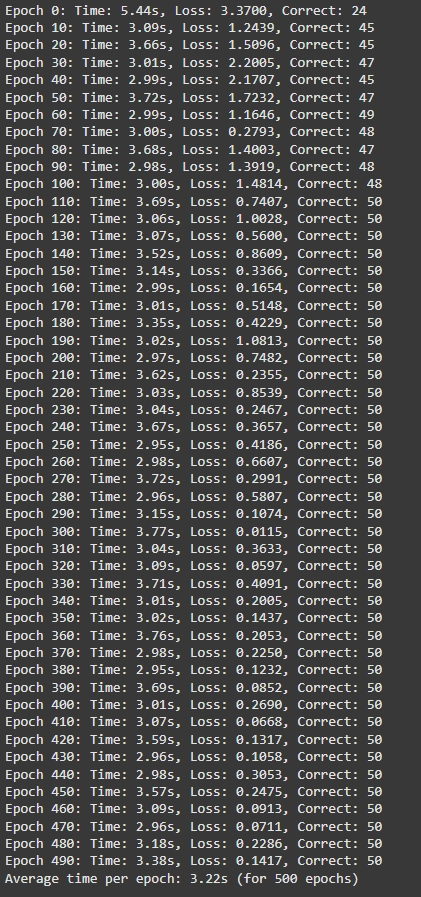

# MiniTorch Module 3


* Docs: https://minitorch.github.io/

* Overview: https://minitorch.github.io/module3.html


Diagnostics output:
================================================================================
 Parallel Accelerator Optimizing:  Function tensor_map.<locals>._map,
C:\Users\ASUS\workspace\mod3-DavidQifongJiang\minitorch\fast_ops.py (175)
================================================================================


Parallel loop listing for  Function tensor_map.<locals>._map, C:\Users\ASUS\workspace\mod3-DavidQifongJiang\minitorch\fast_ops.py (175)
-----------------------------------------------------------------------------------------------------------|loop #ID
    def _map(                                                                                              |
        out: Storage,                                                                                      |
        out_shape: Shape,                                                                                  |
        out_strides: Strides,                                                                              |
        in_storage: Storage,                                                                               |
        in_shape: Shape,                                                                                   |
        in_strides: Strides,                                                                               |
    ) -> None:                                                                                             |
        """Applies a function element-wise from input storage to output storage, handling broadcasting.    |
                                                                                                           |
        For each element in the output, this maps the corresponding input element                          |
        (with broadcasting if needed), applies a transformation, and saves the result                      |
        in the output storage.                                                                             |
                                                                                                           |
        Args:                                                                                              |
        ----                                                                                               |
            out (Storage): Output storage for transformed elements.                                        |
            out_shape (Shape): Shape of the output storage.                                                |
            out_strides (Strides): Strides for accessing output storage.                                   |
            in_storage (Storage): Input storage with elements to transform.                                |
            in_shape (Shape): Shape of the input storage.                                                  |
            in_strides (Strides): Strides for accessing input storage.                                     |
                                                                                                           |
        Note:                                                                                              |
        ----                                                                                               |
            This function uses parallel processing with `prange` for speed.                                |
                                                                                                           |
        """                                                                                                |
        # TODO: Implement for Task 3.1.                                                                    |
        for index in prange(len(out)):---------------------------------------------------------------------| #2
            index_out = np.zeros(MAX_DIMS, np.int32)-------------------------------------------------------| #0
            index_in = np.zeros(MAX_DIMS, np.int32)--------------------------------------------------------| #1
            to_index(index, out_shape, index_out)                                                          |
            broadcast_index(index_out, out_shape, in_shape, index_in)                                      |
            element = in_storage[index_to_position(index_in, in_strides)]                                  |
            processed_element = fn(element)                                                                |
            out[index_to_position(index_out, out_strides)] = processed_element                             |
--------------------------------- Fusing loops ---------------------------------
Attempting fusion of parallel loops (combines loops with similar properties)...
Following the attempted fusion of parallel for-loops there are 3 parallel for-
loop(s) (originating from loops labelled: #2, #0, #1).
--------------------------------------------------------------------------------
---------------------------- Optimising loop nests -----------------------------
Attempting loop nest rewrites (optimising for the largest parallel loops)...

+--2 is a parallel loop
   +--0 --> rewritten as a serial loop
   +--1 --> rewritten as a serial loop
--------------------------------------------------------------------------------
----------------------------- Before Optimisation ------------------------------
Parallel region 0:
+--2 (parallel)
   +--0 (parallel)
   +--1 (parallel)


--------------------------------------------------------------------------------
------------------------------ After Optimisation ------------------------------
Parallel region 0:
+--2 (parallel)
   +--0 (serial)
   +--1 (serial)


Parallel region 0 (loop #2) had 0 loop(s) fused and 2 loop(s) serialized as part
 of the larger parallel loop (#2).
--------------------------------------------------------------------------------
--------------------------------------------------------------------------------

---------------------------Loop invariant code motion---------------------------
Allocation hoisting:
The memory allocation derived from the instruction at
C:\Users\ASUS\workspace\mod3-DavidQifongJiang\minitorch\fast_ops.py (205) is
hoisted out of the parallel loop labelled #2 (it will be performed before the
loop is executed and reused inside the loop):
   Allocation:: index_out = np.zeros(MAX_DIMS, np.int32)
    - numpy.empty() is used for the allocation.
The memory allocation derived from the instruction at
C:\Users\ASUS\workspace\mod3-DavidQifongJiang\minitorch\fast_ops.py (206) is
hoisted out of the parallel loop labelled #2 (it will be performed before the
loop is executed and reused inside the loop):
   Allocation:: index_in = np.zeros(MAX_DIMS, np.int32)
    - numpy.empty() is used for the allocation.
None
ZIP

================================================================================
 Parallel Accelerator Optimizing:  Function tensor_zip.<locals>._zip,
C:\Users\ASUS\workspace\mod3-DavidQifongJiang\minitorch\fast_ops.py (239)
================================================================================


Parallel loop listing for  Function tensor_zip.<locals>._zip, C:\Users\ASUS\workspace\mod3-DavidQifongJiang\minitorch\fast_ops.py (239)
-------------------------------------------------------------------------------|loop #ID
    def _zip(                                                                  |
        out: Storage,                                                          |
        out_shape: Shape,                                                      |
        out_strides: Strides,                                                  |
        a_storage: Storage,                                                    |
        a_shape: Shape,                                                        |
        a_strides: Strides,                                                    |
        b_storage: Storage,                                                    |
        b_shape: Shape,                                                        |
        b_strides: Strides,                                                    |
    ) -> None:                                                                 |
        # TODO: Implement for Task 3.1.                                        |
        for index in prange(len(out)):-----------------------------------------| #6
            index_out = np.zeros(MAX_DIMS, np.int32)---------------------------| #3
            index_a = np.zeros(MAX_DIMS, np.int32)-----------------------------| #4
            index_b = np.zeros(MAX_DIMS, np.int32)-----------------------------| #5
            to_index(index, out_shape, index_out)                              |
            broadcast_index(index_out, out_shape, a_shape, index_a)            |
            broadcast_index(index_out, out_shape, b_shape, index_b)            |
            value_a = a_storage[index_to_position(index_a, a_strides)]         |
            value_b = b_storage[index_to_position(index_b, b_strides)]         |
                                                                               |
            combined_value = fn(value_a, value_b)                              |
            out[index_to_position(index_out, out_strides)] = combined_value    |
--------------------------------- Fusing loops ---------------------------------
Attempting fusion of parallel loops (combines loops with similar properties)...
Following the attempted fusion of parallel for-loops there are 4 parallel for-
loop(s) (originating from loops labelled: #6, #3, #4, #5).
--------------------------------------------------------------------------------
---------------------------- Optimising loop nests -----------------------------
Attempting loop nest rewrites (optimising for the largest parallel loops)...

+--6 is a parallel loop
   +--3 --> rewritten as a serial loop
   +--4 --> rewritten as a serial loop
   +--5 --> rewritten as a serial loop
--------------------------------------------------------------------------------
----------------------------- Before Optimisation ------------------------------
Parallel region 0:
+--6 (parallel)
   +--3 (parallel)
   +--4 (parallel)
   +--5 (parallel)


--------------------------------------------------------------------------------
------------------------------ After Optimisation ------------------------------
Parallel region 0:
+--6 (parallel)
   +--3 (serial)
   +--4 (serial)
   +--5 (serial)


Parallel region 0 (loop #6) had 0 loop(s) fused and 3 loop(s) serialized as part
 of the larger parallel loop (#6).
--------------------------------------------------------------------------------
--------------------------------------------------------------------------------

---------------------------Loop invariant code motion---------------------------
Allocation hoisting:
The memory allocation derived from the instruction at
C:\Users\ASUS\workspace\mod3-DavidQifongJiang\minitorch\fast_ops.py (252) is
hoisted out of the parallel loop labelled #6 (it will be performed before the
loop is executed and reused inside the loop):
   Allocation:: index_out = np.zeros(MAX_DIMS, np.int32)
    - numpy.empty() is used for the allocation.
The memory allocation derived from the instruction at
C:\Users\ASUS\workspace\mod3-DavidQifongJiang\minitorch\fast_ops.py (253) is
hoisted out of the parallel loop labelled #6 (it will be performed before the
loop is executed and reused inside the loop):
   Allocation:: index_a = np.zeros(MAX_DIMS, np.int32)
    - numpy.empty() is used for the allocation.
The memory allocation derived from the instruction at
C:\Users\ASUS\workspace\mod3-DavidQifongJiang\minitorch\fast_ops.py (254) is
hoisted out of the parallel loop labelled #6 (it will be performed before the
loop is executed and reused inside the loop):
   Allocation:: index_b = np.zeros(MAX_DIMS, np.int32)
    - numpy.empty() is used for the allocation.
None
REDUCE

================================================================================
 Parallel Accelerator Optimizing:  Function tensor_reduce.<locals>._reduce,
C:\Users\ASUS\workspace\mod3-DavidQifongJiang\minitorch\fast_ops.py (288)
================================================================================


Parallel loop listing for  Function tensor_reduce.<locals>._reduce, C:\Users\ASUS\workspace\mod3-DavidQifongJiang\minitorch\fast_ops.py (288)
---------------------------------------------------------------------------|loop #ID
    def _reduce(                                                           |
        out: Storage,                                                      |
        out_shape: Shape,                                                  |
        out_strides: Strides,                                              |
        a_storage: Storage,                                                |
        a_shape: Shape,                                                    |
        a_strides: Strides,                                                |
        reduce_dim: int,                                                   |
    ) -> None:                                                             |
        # TODO: Implement for Task 3.1.                                    |
        for index in prange(len(out)):-------------------------------------| #8
            index_out = np.zeros(MAX_DIMS, np.int32)-----------------------| #7
            to_index(index, out_shape, index_out)                          |
                                                                           |
            out_pos = index_to_position(index_out, out_strides)            |
                                                                           |
            result = out[out_pos]                                          |
            w = index_to_position(index_out, a_strides)                    |
            stride = a_strides[reduce_dim]                                 |
            reduction_size = a_shape[reduce_dim]                           |
                                                                           |
            for z in range(reduction_size):                                |
                result = fn(result, a_storage[w])                          |
                w += stride                                                |
                                                                           |
            # Store the accumulated result back into the output storage    |
            out[out_pos] = result                                          |
--------------------------------- Fusing loops ---------------------------------
Attempting fusion of parallel loops (combines loops with similar properties)...
Following the attempted fusion of parallel for-loops there are 2 parallel for-
loop(s) (originating from loops labelled: #8, #7).
--------------------------------------------------------------------------------
---------------------------- Optimising loop nests -----------------------------
Attempting loop nest rewrites (optimising for the largest parallel loops)...

+--8 is a parallel loop
   +--7 --> rewritten as a serial loop
--------------------------------------------------------------------------------
----------------------------- Before Optimisation ------------------------------
Parallel region 0:
+--8 (parallel)
   +--7 (parallel)


--------------------------------------------------------------------------------
------------------------------ After Optimisation ------------------------------
Parallel region 0:
+--8 (parallel)
   +--7 (serial)


Parallel region 0 (loop #8) had 0 loop(s) fused and 1 loop(s) serialized as part
 of the larger parallel loop (#8).
--------------------------------------------------------------------------------
--------------------------------------------------------------------------------

---------------------------Loop invariant code motion---------------------------
Allocation hoisting:
The memory allocation derived from the instruction at
C:\Users\ASUS\workspace\mod3-DavidQifongJiang\minitorch\fast_ops.py (299) is
hoisted out of the parallel loop labelled #8 (it will be performed before the
loop is executed and reused inside the loop):
   Allocation:: index_out = np.zeros(MAX_DIMS, np.int32)
    - numpy.empty() is used for the allocation.
None
MATRIX MULTIPLY

================================================================================
 Parallel Accelerator Optimizing:  Function _tensor_matrix_multiply,
C:\Users\ASUS\workspace\mod3-DavidQifongJiang\minitorch\fast_ops.py (319)
================================================================================


Parallel loop listing for  Function _tensor_matrix_multiply, C:\Users\ASUS\workspace\mod3-DavidQifongJiang\minitorch\fast_ops.py (319)
-------------------------------------------------------------------------------------------|loop #ID
def _tensor_matrix_multiply(                                                               |
    out: Storage,                                                                          |
    out_shape: Shape,                                                                      |
    out_strides: Strides,                                                                  |
    a_storage: Storage,                                                                    |
    a_shape: Shape,                                                                        |
    a_strides: Strides,                                                                    |
    b_storage: Storage,                                                                    |
    b_shape: Shape,                                                                        |
    b_strides: Strides,                                                                    |
) -> None:                                                                                 |
    """NUMBA tensor matrix multiply function.                                              |
                                                                                           |
    Should work for any tensor shapes that broadcast as long as                            |
                                                                                           |
    ```                                                                                    |
    assert a_shape[-1] == b_shape[-2]                                                      |
    ```                                                                                    |
                                                                                           |
    Optimizations:                                                                         |
                                                                                           |
    * Outer loop in parallel                                                               |
    * No index buffers or function calls                                                   |
    * Inner loop should have no global writes, 1 multiply.                                 |
                                                                                           |
                                                                                           |
    Args:                                                                                  |
    ----                                                                                   |
        out (Storage): storage for `out` tensor                                            |
        out_shape (Shape): shape for `out` tensor                                          |
        out_strides (Strides): strides for `out` tensor                                    |
        a_storage (Storage): storage for `a` tensor                                        |
        a_shape (Shape): shape for `a` tensor                                              |
        a_strides (Strides): strides for `a` tensor                                        |
        b_storage (Storage): storage for `b` tensor                                        |
        b_shape (Shape): shape for `b` tensor                                              |
        b_strides (Strides): strides for `b` tensor                                        |
                                                                                           |
    Returns:                                                                               |
    -------                                                                                |
        None : Fills in `out`                                                              |
                                                                                           |
    """                                                                                    |
    a_batch_stride = a_strides[0] if a_shape[0] > 1 else 0                                 |
    b_batch_stride = b_strides[0] if b_shape[0] > 1 else 0                                 |
                                                                                           |
    # TODO: Implement for Task 3.2.                                                        |
    for s in prange(out_shape[0]):---------------------------------------------------------| #11
        for i in prange(out_shape[1]):-----------------------------------------------------| #10
            for j in prange(out_shape[2]):-------------------------------------------------| #9
                index_a = s * a_batch_stride + i * a_strides[1]                            |
                index_b = s * b_batch_stride + j * b_strides[2]                            |
                res = 0.0                                                                  |
                for k in range(a_shape[2]):                                                |
                    res += a_storage[index_a] * b_storage[index_b]                         |
                    index_a += a_strides[2]                                                |
                    index_b += b_strides[1]                                                |
                out[s * out_strides[0] + i * out_strides[1] + j * out_strides[2]] = res    |
--------------------------------- Fusing loops ---------------------------------
Attempting fusion of parallel loops (combines loops with similar properties)...
Following the attempted fusion of parallel for-loops there are 2 parallel for-
loop(s) (originating from loops labelled: #11, #10).
--------------------------------------------------------------------------------
---------------------------- Optimising loop nests -----------------------------
Attempting loop nest rewrites (optimising for the largest parallel loops)...

+--11 is a parallel loop
   +--10 --> rewritten as a serial loop
      +--9 --> rewritten as a serial loop
--------------------------------------------------------------------------------
----------------------------- Before Optimisation ------------------------------
Parallel region 0:
+--11 (parallel)
   +--10 (parallel)
      +--9 (parallel)


--------------------------------------------------------------------------------
------------------------------ After Optimisation ------------------------------
Parallel region 0:
+--11 (parallel)
   +--10 (serial)
      +--9 (serial)


Parallel region 0 (loop #11) had 0 loop(s) fused and 2 loop(s) serialized as
part of the larger parallel loop (#11).
--------------------------------------------------------------------------------
--------------------------------------------------------------------------------

---------------------------Loop invariant code motion---------------------------
Allocation hoisting:
No allocation hoisting found
None


---

## Section 3.4: GPU vs Naive Approach



---

## CPU vs GPU Performance

### CPU Performance

#### 1. **Simple Dataset**
- **Loss Plot**
  

- **Training Log and Time Plot**
  

---

#### 2. **Diag Dataset**
- **Loss Plot**
  

- **Training Log and Time Plot**
  

---

#### 3. **Split Dataset**
- **Loss Plot**
  

- **Training Log and Time Plot**
  

---

#### 4. **Xor Dataset**
- **Loss Plot**
  

- **Training Log and Time Plot**
  

---

## GPU Simple Dataset
!cd $DIR; PYTHONPATH=/content/$DIR python3.12 project/run_fast_tensor.py --BACKEND gpu --HIDDEN 100 --DATASET simple --RATE 0.05


## GPU Split Dataset
!cd $DIR; PYTHONPATH=/content/$DIR python3.12 project/run_fast_tensor.py --BACKEND gpu --HIDDEN 100 --DATASET simple --RATE 0.05


## GPU Xor Dataset
!cd $DIR; PYTHONPATH=/content/$DIR python3.12 project/run_fast_tensor.py --BACKEND gpu --HIDDEN 100 --DATASET simple --RATE 0.05



## Bigger model (hidder layer = 300)

## CPU xor Dataset


## GPU xor Dataset



You will need to modify `tensor_functions.py` slightly in this assignment.

* Tests:

```
python run_tests.py
```

* Note:

Several of the tests for this assignment will only run if you are on a GPU machine and will not
run on github's test infrastructure. Please follow the instructions to setup up a colab machine
to run these tests.

This assignment requires the following files from the previous assignments. You can get these by running

```bash
python sync_previous_module.py previous-module-dir current-module-dir
```

The files that will be synced are:

        minitorch/tensor_data.py minitorch/tensor_functions.py minitorch/tensor_ops.py minitorch/operators.py minitorch/scalar.py minitorch/scalar_functions.py minitorch/module.py minitorch/autodiff.py minitorch/module.py project/run_manual.py project/run_scalar.py project/run_tensor.py minitorch/operators.py minitorch/module.py minitorch/autodiff.py minitorch/tensor.py minitorch/datasets.py minitorch/testing.py minitorch/optim.py